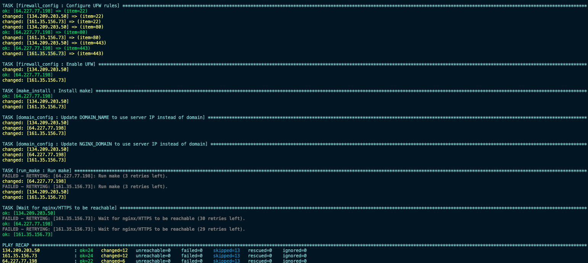

# Cloud-1 – Automated Cloud Deployment with Ansible

## Overview

This project demonstrates how to automate the deployment of a containerized web application stack on a cloud VPS using Ansible and Docker.

The goal is to eliminate manual server configuration and instead deploy the entire infrastructure using Infrastructure as Code (IaC) principles.

With a single Ansible playbook, a fresh server can be configured to:

- Install Docker and all required dependencies
- Deploy application containers
- Configure services and networking
- Start the full stack automatically

Once deployment completes, the application is accessible through the server's public IP address and can optionally be served under a custom domain.

---

## Prerequisites

Before running the playbook, ensure the following:

- A cloud VPS running Ubuntu (tested on Ubuntu 22.04)
- Ansible installed on your local machine
- Passwordless SSH access configured to the target server
- The `.env` file is filled in (see [Environment Variables](#environment-variables))

---

## Architecture

The deployed stack consists of the following services:

```text
Internet
    │
    ▼
Cloud VPS
    │
    ├── Docker
    │
    ├── Nginx  (HTTPS reverse proxy — self-signed certificate)
    │
    ├── WordPress
    │
    ├── MariaDB
    │
    └── phpMyAdmin  (accessible at /phpmyadmin)
```

> ⚠️ **Note on HTTPS:** The stack uses a self-signed TLS certificate. Your browser will display a security warning on first visit — this is expected. You can safely proceed by accepting the warning, or replace the certificate with a valid one (e.g. via Let's Encrypt) once a domain is configured.

All services are containerized and managed using Docker.

---

## Technologies Used

| Tool | Purpose |
|------|---------|
| Ansible | Infrastructure automation |
| Docker | Containerization |
| Nginx | Web server / HTTPS reverse proxy |
| WordPress | Web application |
| MariaDB | Database |
| phpMyAdmin | Database management UI |
| Linux (Ubuntu) | Cloud server OS |

---

## Repository Structure

```text
cloud-1/
│
├── ansible/
│   ├── inventory.ini
│   ├── cloud-1.yaml
│   ├── requirements.yml
│   └── Roles/
│       ├── domain_config/
│       ├── firewall_config/
│       ├── geerlingguy.docker/
│       ├── make_install/
│       ├── run_make/
│       └── site_dir/
│
├── cloud-1_dev/
│   ├── srcs/
│   │   └── .env          ← fill this in before deploying
│   ├── cleaner.sh
│   ├── makefile
│   └── .gitignore
│
└── README.md
```

---

## Environment Variables

Before deploying, create and fill in the `.env` file at `cloud-1_dev/srcs/.env`. This file is required for WordPress and MariaDB to start correctly.

```dotenv
# === MariaDB credentials ===
MYSQL_ROOT_PASSWORD=         # Root password for MariaDB
MYSQL_DATABASE=              # Name of the WordPress database
MYSQL_USER=                  # MariaDB user for WordPress
MYSQL_PASSWORD=              # Password for the above user
MYSQL_HOST=                  # Hostname of the MariaDB container (usually: mariadb)

# === WordPress configuration ===
DB_HOST=                     # Same as MYSQL_HOST
WORDPRESS_DB_HOST=           # Same as MYSQL_HOST

DATABASE_NAME=               # Same as MYSQL_DATABASE
WORDPRESS_DB_NAME=           # Same as MYSQL_DATABASE
DOMAIN_NAME=                 # Your domain or server IP (e.g. example.com or 203.0.113.10)
BRAND="My WP"                # Display name for the WordPress site

# WordPress admin account
WORDPRESS_ADMIN=             # Admin username
WORDPRESS_ADMIN_PASSWORD=    # Admin password
WORDPRESS_ADMIN_EMAIL=       # Admin email address

# Regular WordPress user
LOGIN=                       # Username for a regular WP user
WP_USER_EMAIL=               # Email for the regular user
WP_USER_PWD=                 # Password for the regular user

# === Nginx configuration ===
NGINX_DOMAIN=                # Domain Nginx will serve (same as DOMAIN_NAME)
```

> ⚠️ **Never commit this file.** It is listed in `.gitignore` and contains sensitive credentials.

---

## Deployment

### 1. Configure the inventory

Add your server's IP address and SSH user to `ansible/inventory.ini`:

```ini
[servers]
203.0.113.10 ansible_user=yahia
```

### 2. Install Galaxy roles

```bash
ansible-galaxy install -r ansible/requirements.yml
```

### 3. Run the playbook

```bash
ansible-playbook -i ansible/inventory.ini ansible/cloud-1.yaml
```

The playbook will:

- Connect to the remote server via SSH
- Install Docker and dependencies
- Transfer project files
- Start all containers



### 4. Access the application

| Service | URL |
|---------|-----|
| WordPress | `https://SERVER_IP` |
| phpMyAdmin | `https://SERVER_IP/phpmyadmin` |

---

## Project Goals

- Automate server configuration end-to-end
- Deploy services in reproducible containers
- Practice Infrastructure as Code principles
- Understand cloud deployment workflows

---

## Author

**Yahia Elboukili**

GitHub: [yahyaeb](https://github.com/yahyaeb)
